# HW3
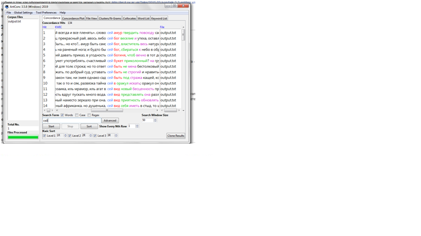
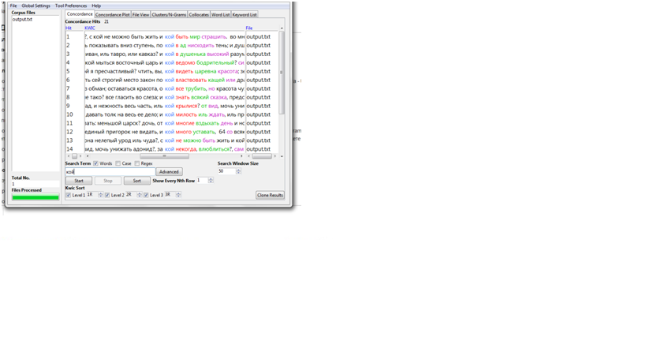
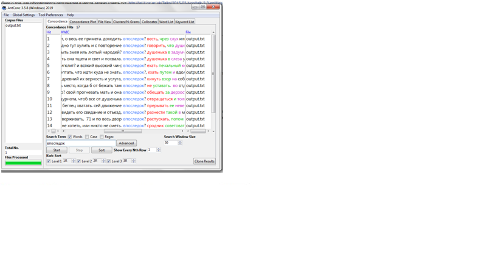
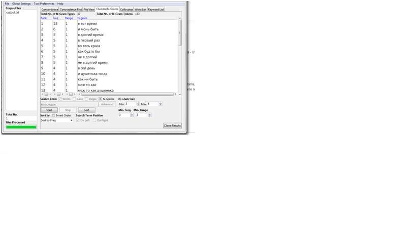
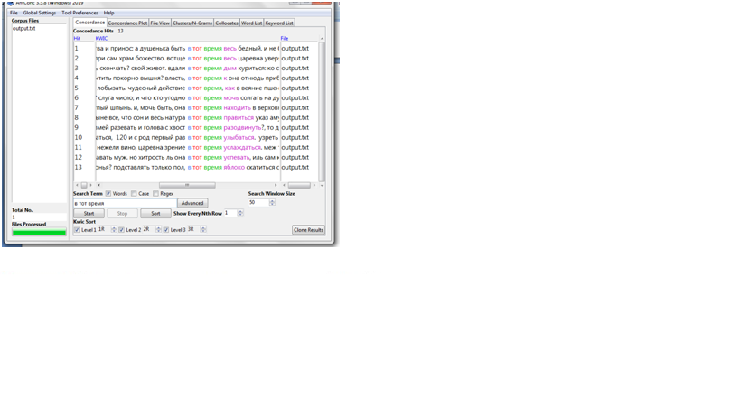
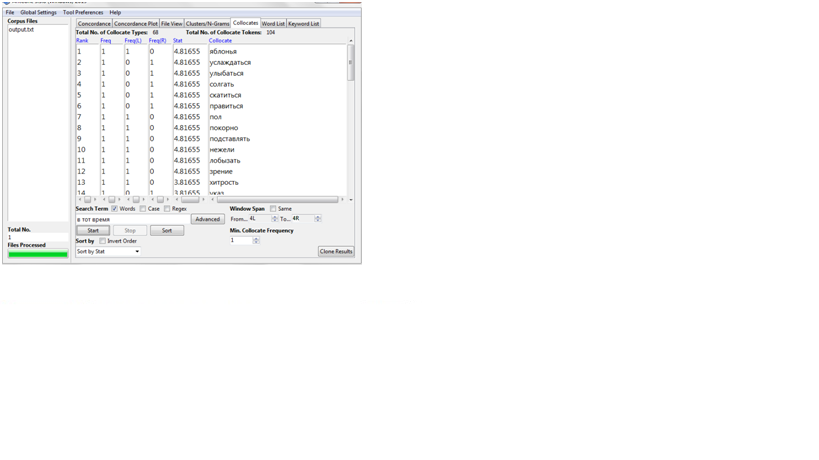
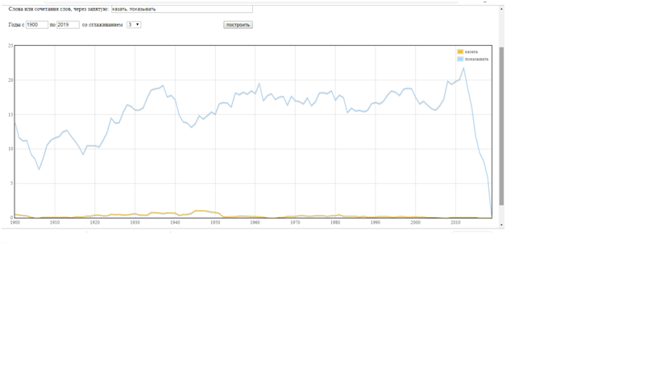
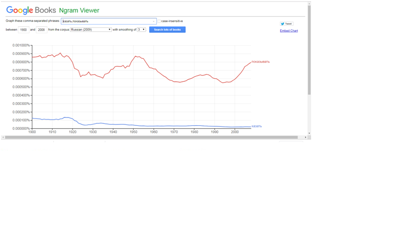
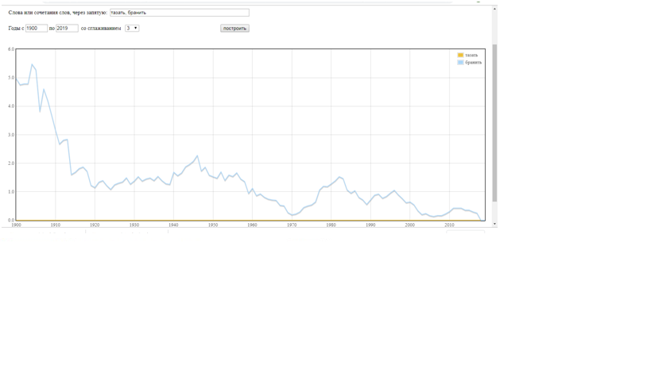
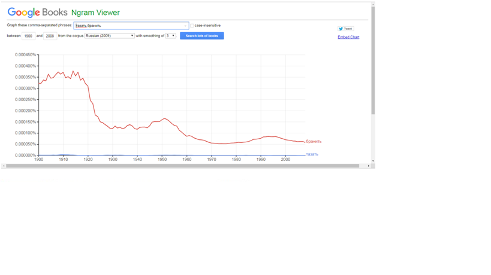
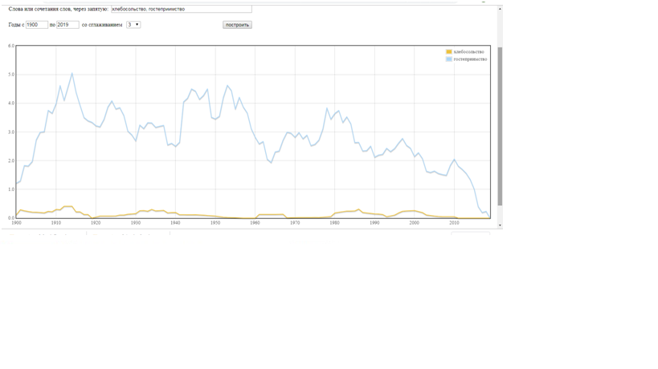
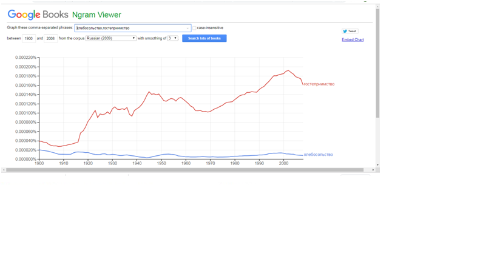

2)Казать ipm-0,385
Тазать ipm -0,011
Хлебосольство ipm -0,244

Выводы: 
НКРЯ и Google Ngrams могут помочь понять частоту использования слова в разное время. Однако в связи с тем, что источники у корпусов разные, предоставляемые данные также будут различны.
3)Инструменты корпусного анализа в моей профессиональной деятельности без сомнения мне очень помогут. Прежде всего потому что их создавали специально для филологов и лингвистов, а, значит, корпуса должны удоволетворять наши потребности.

Теперь я могу не только работать с целым текстом, но и с его деталями. Больше нет необходимости что-то считать вручную.

Изученные инструменты помогут мне в работе с курсовой работой. Мне понадобится найти описания немецких женщин в произведениях русских писателей в период Первой Мировой. К счастью, я могу не ехать в РГБ и не заказывать всю литературу того времени, а могу зайти в НКРЯ и поискать в подкорпусах словосочетание '' немецкая женщина".
